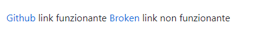

# Broken-Links-Checker

This GitHub Actions workflow checks the links in your README.md file and creates an issue if broken links are found.


## How it works

1. The workflow is triggered on every push to the `master` branch and runs on a monthly schedule on the 1st day of the month.
2. It extracts all the links from your README.md file.
3. It checks if the links are reachable using cURL.
4. If broken links are found, it creates an issue in your repository, listing the broken links.

## Setup

### Prerequisites

Make sure you have the following set up:

- A GitHub repository where you want to implement this workflow.
- An `.github/workflows` directory in your repository.
- An `ISSUE_TEMPLATE.md` file in your `.github` directory for issue creation. Customize it according to your needs.

### Workflow Configuration

Create a new YAML file, for example, `broken-links-check.yml`, in your `.github/workflows` directory with the following content:

```yaml
name: Broken Links Checker
on:
  push:
    branches:
      - main
  schedule:
     - cron: '0 0 1 * *'

env:
  ISSUE_TEMPLATE: ".github/workflows/ISSUE_TEMPLATE.md"

jobs:
  check:
    runs-on: ubuntu-latest

    steps:
    - uses: actions/checkout@v3
    - name: Get links from README.md
      id: get-links
      run: |
        LINKS=$(grep -oP '\[.*?\]\((http[s]?://[^)]*)\)' README.md | sed -E 's/\[.*\]\(([^)]+)\)/\1/' | paste -sd "," -)
        echo "WEBSITE_URL=$LINKS" >> $GITHUB_ENV

    - name: Run Broken Links Checker
      run: |
        IFS=',' read -ra LINKS <<< "$WEBSITE_URL"
        BROKEN_LINKS=""

        for link in "${LINKS[@]}"; do
          if [[ $link =~ ^(http|https):// ]]; then
            if ! curl -IsSk "$link" > /dev/null; then
              BROKEN_LINKS="$BROKEN_LINKS,$link"
            fi
          fi
        done

        if [ -n "$BROKEN_LINKS" ]; then
          BROKEN_LINKS=$(echo "$BROKEN_LINKS" | cut -c 2-)
          echo "BROKEN_LINKS=$BROKEN_LINKS" >> $GITHUB_ENV
          echo "Broken links found: $BROKEN_LINKS"
          echo "Broken links found, failing the workflow"
          exit 1
        else
          echo "No broken links found"
        fi

    - uses: actions/checkout@v3
      if: failure()

    - uses: JasonEtco/create-an-issue@v2
      env:
        GITHUB_TOKEN: ${{ secrets.GITHUB_TOKEN }}
      with:
        filename: ${{ env.ISSUE_TEMPLATE }}
      if: failure()
```

This configuration sets up the workflow to run on pushes to the `main` branch and also schedules it to run on the 1st day of every month. It checks for broken links in your README.md file and creates an issue with the broken links if any are found.

Make sure to customize the `ISSUE_TEMPLATE.md` file according to the content you want for the created issues.

Now, every time this workflow runs, it will check for broken links in your README.md and create issues in your repository if any are found.

## Workflow Execution
- 
- 
